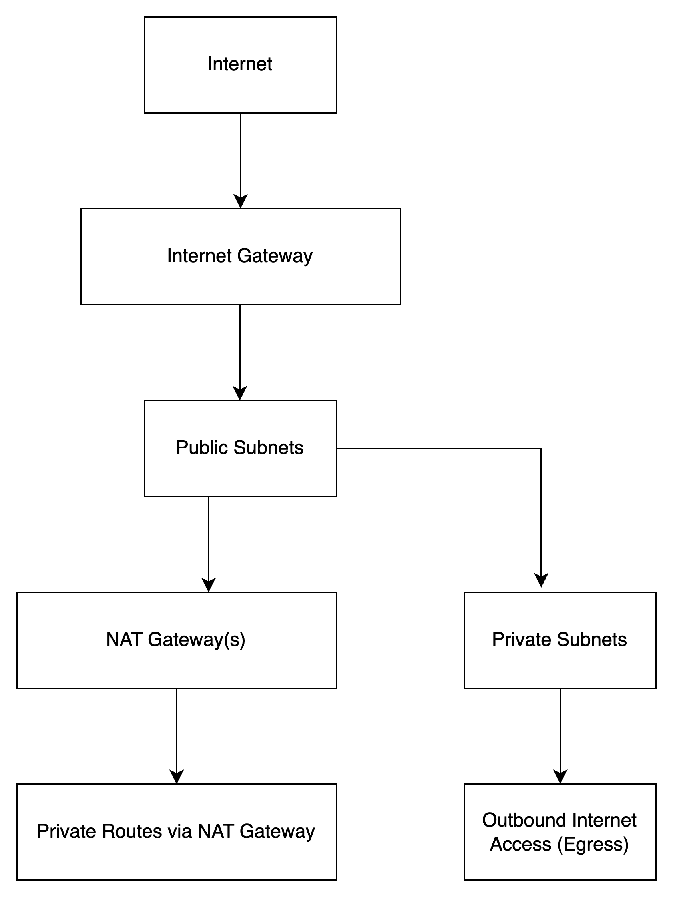

# 🔐 Secure VPC Terraform Module

## Overview
This Terraform module provisions a secure and production-ready VPC on AWS, complete with:

- Public and private subnets across multiple Availability Zones
- Internet Gateway and NAT Gateways for scalable access
- Route tables and subnet associations
- Flow logs to CloudWatch
- Remote state backend (S3 + DynamoDB)
- Built for multi-AZ deployments using `count`
## Usage

```hcl
module "secure_vpc" {
   source     = "./modules/vpc"
   vpc_cidr   = "10.0.0.0/16"
   name_prefix = "prod"
}

